# Баг-репорты — Lucky Test
## Проект: [lucky-test.ru](https://lucky-test.ru/test-task/index.html)

### ID: BUG-001  
**Название:** Отсутствие валидации имени в форме "Заказать звонок"

**Описание:**  
Поле "Имя" принимает цифры, спецсимволы, не имеет ограничения длины и не показывает ошибки

**Шаги воспроизведения:**
1. Нажать "Заказать звонок" в шапке сайта.
2. Ввести цифры/спецсимволы в поле "Имя": `123!@#` (или оставить пустым).
3. Отправить форму.

**Ожидаемый результат:**  
Поле должно принимать только буквы и быть ограничено по длине. Сообщение об ошибке при невалидном вводе

**Фактический результат:**  
Поле принимает любые символы, пустое значение. Ошибки не отображаются

**Серьезность:** `Critical`

**Приоритет:** `High`

**Окружение:** Windows 10 Pro, версия 22H2, Яндекс Браузер версия 25.6.0.2261 (64-bit)

**Вложение:**
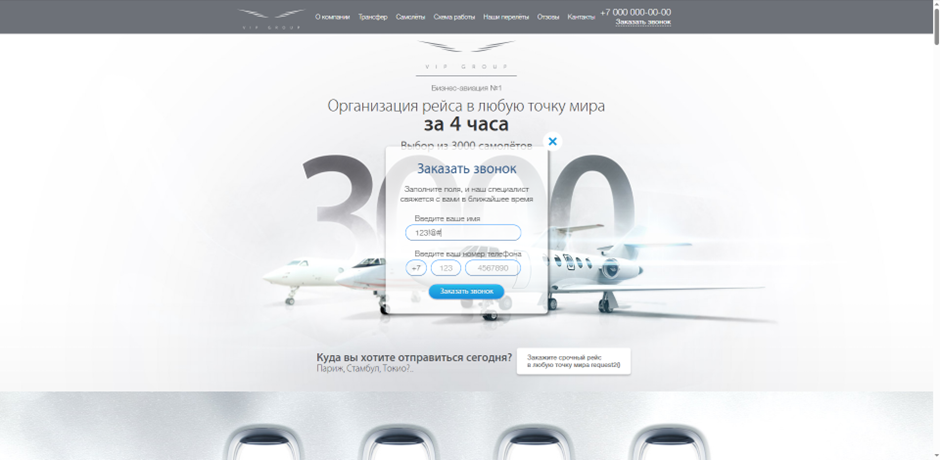
---

### ID: BUG-002  
**Название:** Отсутствие валидации номера телефона в форме "Заказать звонок"

**Описание:**  
Поля телефона (код страны, номер) принимают буквы/спецсимволы, не имеют ограничения длины

**Шаги воспроизведения:**
1. Нажать "Заказать звонок" в шапке сайта.
2. В поле "Код страны" ввести `abc`.
3. В поле "Номер" ввести `!@#xyz`.
4. Нажать “Заказать звонок”.

**Ожидаемый результат:**  
Поле номера телефона должно принимать только цифры. Автоматическое форматирование. Ограничение длины (код страны/региона: 1-3 цифры)

**Фактический результат:**  
Поле номера телефона принимает буквы/спецсимволы. Поля кода страны/региона без ограничения длины. Нет уведомления об ошибке

**Серьезность:** `Critical`

**Приоритет:** `High`

**Окружение:** Windows 10 Pro, версия 22H2, Яндекс Браузер версия 25.6.0.2261 (64-bit)

**Вложение:**

---

### ID: BUG-003  
**Название:** Отправка пустой формы "Заказать звонок"

**Описание:**  
Форма отправляется без заполнения обязательных полей

**Шаги воспроизведения:**
1. Открыть форму "Заказать звонок" в шапке сайта.
2. Не заполнять поля.
3. Нажать "Заказать звонок".

**Ожидаемый результат:**  
Блокировка отправки формы, подсветка пустых полей

**Фактический результат:**  
Форма отправляется, появляется уведомление "Спасибо за оставленную заявку"

**Серьезность:** `Critical`

**Приоритет:** `High`

**Окружение:** Windows 10 Pro, версия 22H2, Яндекс Браузер версия 25.6.0.2261 (64-bit)

**Вложение:**
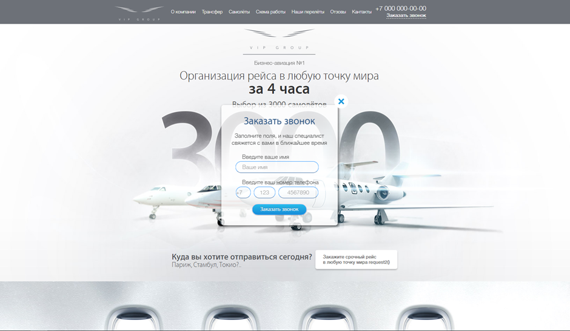
---

### ID: BUG-004  
**Название:** Отсутствие валидации в форме "Получить шампанское в подарок"

**Описание:**  
Аналогичные BUG-001, BUG-002, BUG-003 ошибки в форме "Шампанское в подарок"

**Шаги воспроизведения:**
1. Перейти в раздел "Шампанское в подарок"
2. Отправьте пустую форму
3. Введите невалидные имя/email/телефон
4. Нажать кнопку "Заказать"

**Ожидаемый результат:**  
Корректная валидация всех полей. Блокировка отправки формы при ошибках

**Фактический результат:**  
Отсутствует валидация имя/email/телефона. Форма отправляется при невалидных/пустых данных. Сообщение об успешном создании заявки

**Серьезность:** `Critical`

**Приоритет:** `High`

**Окружение:** Windows 10 Pro, версия 22H2, Яндекс Браузер версия 25.6.0.2261 (64-bit)

**Вложение:**
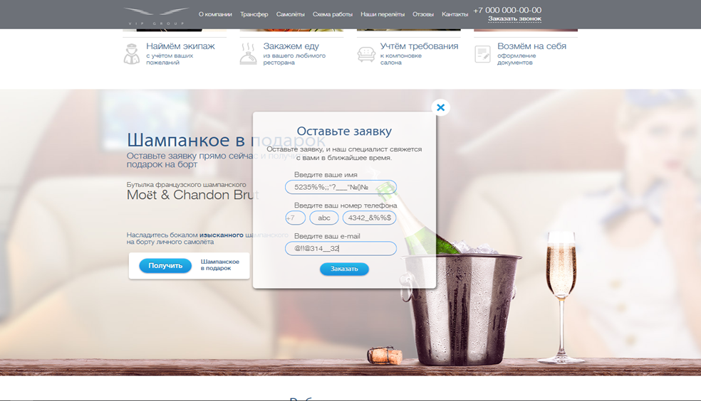
---

### ID: BUG-005  
**Название:** Отсутствие валидации в форме заказа рейса

**Описание:**  
Форма отправляется с пустыми/невалидными данными без ошибок

**Шаги воспроизведения:**
1. Перейти к форме заказа рейса.
2. Оставить поля пустыми или ввести невалидные данные (например, цифры в поле "Откуда", в поле "Имя": `123!@#`, в поле "Номер" ввести `!@#xyz`).

**Ожидаемый результат:**  
Валидация обязательных полей, проверка форматов

**Фактический результат:**  
Форма отправляется без проверки, появляется сообщение об успешном создании заявки

**Серьезность:** `Critical`

**Приоритет:** `High`

**Окружение:** Windows 10 Pro, версия 22H2, Яндекс Браузер версия 25.6.0.2261 (64-bit)

**Вложение:**
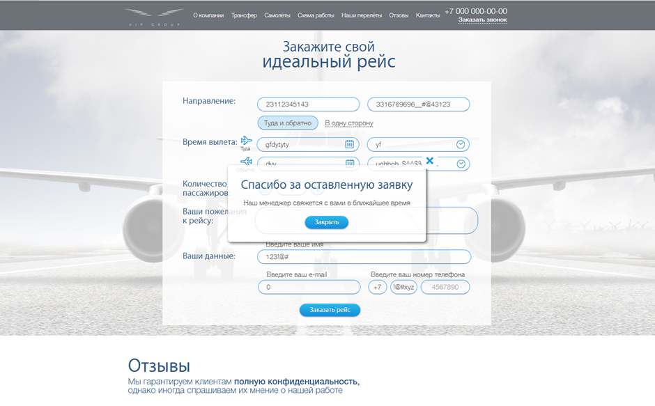
---

### ID: BUG-006  
**Название:** Неактивные элементы в форме заказа рейса

**Описание:**  
Поля "Ваши пожелания к рейсу", "Количество пассажиров" и datepicker в поле “Время вылета” не работают

**Шаги воспроизведения:**
1. Перейти к форме заказа рейса.
2. Кликнуть на "Ваши пожелания к рейсу".
3. Кликнуть на "Количество пассажиров".
4. Кликнуть на datepicker в поле "Время вылета".

**Ожидаемый результат:**  
Поля ввода/выбора активны

**Фактический результат:**  
Элементы не реагируют

**Серьезность:** `Critical`

**Приоритет:** `High`

**Окружение:** Windows 10 Pro, версия 22H2, Яндекс Браузер версия 25.6.0.2261 (64-bit)

**Вложение:**
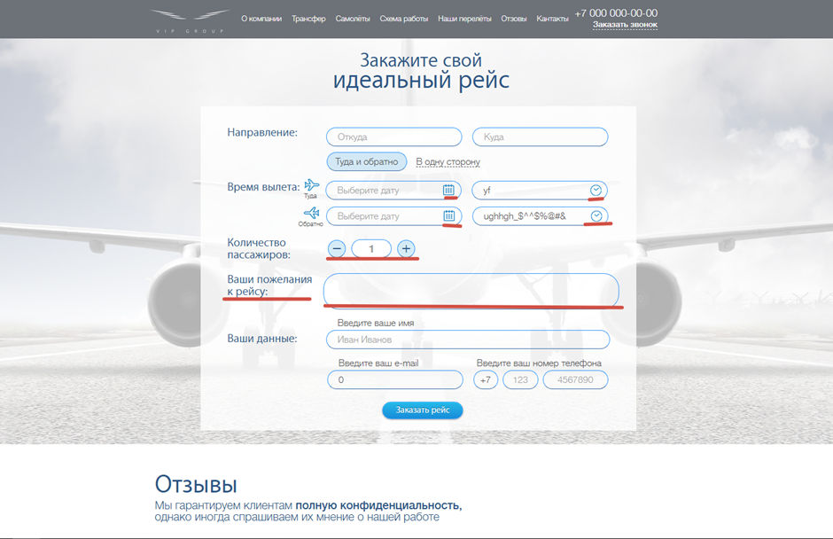
---

### ID: BUG-007  
**Название:** Нарушение логики направления рейса

**Описание:**  
При выборе поля "В одну сторону" остаются активными поля обратного рейса

**Шаги воспроизведения:**
1. Перейти к форме заказа рейса.
2. Выбрать "В одну сторону".
3. Проверить поля "Дата/время обратно".

**Ожидаемый результат:**  
Поля блокируются

**Фактический результат:**  
Поля доступны для редактирования

**Серьезность:** `Major`

**Приоритет:** `High`

**Окружение:** Windows 10 Pro, версия 22H2, Яндекс Браузер версия 25.6.0.2261 (64-bit)

**Вложение:**
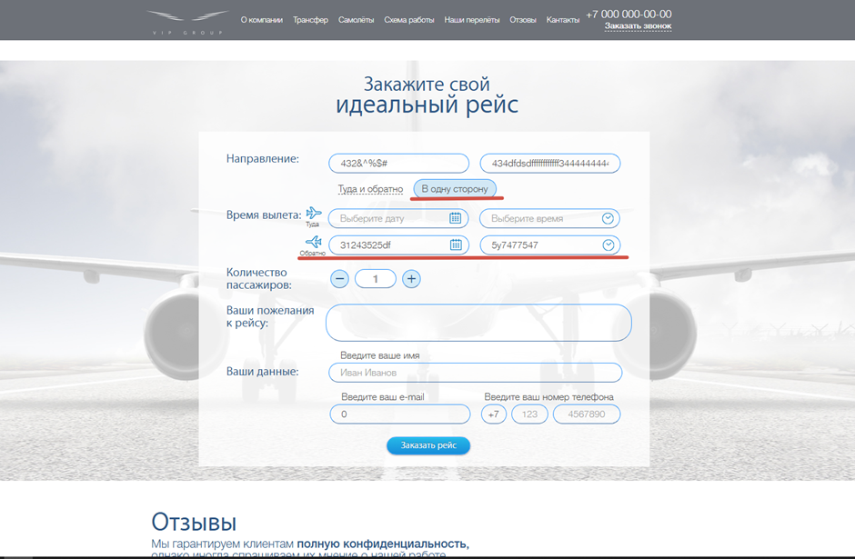
---

### ID: BUG-008  
**Название:** Нерабочие ссылки в футере

**Описание:**  
Ссылки на соцсети и политику конфиденциальности ведут на начало страницы. "Заказать звонок" неактивна

**Шаги воспроизведения:**
1. Прокрутить страницу в футер.
2. В футере нажать "Политика конфиденциальности"
3. Нажать "Заказать звонок"
4. Кликнуть на иконки соцсетей

**Ожидаемый результат:**  
Политика конфиденциальности открывается PDF файлом/страницей с документом. Ссылка "Заказать звонок" открывает форму. Ссылки на соцсети переходят на профили компании.

**Фактический результат:**  
Все ссылки ведут на начало страницы. Ссылка "Заказать звонок" не реагирует и не открывает форму

**Серьезность:** `Major`

**Приоритет:** `Medium`

**Окружение:** Windows 10 Pro, версия 22H2, Яндекс Браузер версия 25.6.0.2261 (64-bit)

**Вложение:**

---

### ID: BUG-009  
**Название:** Частично скрытый контактный блок

**Описание:**  
Адрес компании не виден в футере при первоначальной загрузке страницы

**Шаги воспроизведения:**
1. Загрузить главную страницу.
2. Прокрутить страницу вниз без нажатия на поле "Контакты" в навигационном меню.
3. Наблюдаем: блок контактов обрезан (видна только верхняя часть).
4. Нажать в шапке на пункт меню "Контакты".
5. Страница автоматически прокручивается вниз, и блок контактов отображается полностью.

**Ожидаемый результат:**  
Контактная информация должна быть полностью видна при обычной прокрутке до футера без необходимости использования якорной ссылки

**Фактический результат:**  
При обычной загрузке страницы (без нажатия на меню) блок контактов в футере обрезан

**Серьезность:** `Minor`

**Приоритет:** `Medium`

**Окружение:** Windows 10 Pro, версия 22H2, Яндекс Браузер версия 25.6.0.2261 (64-bit)

**Вложение:**
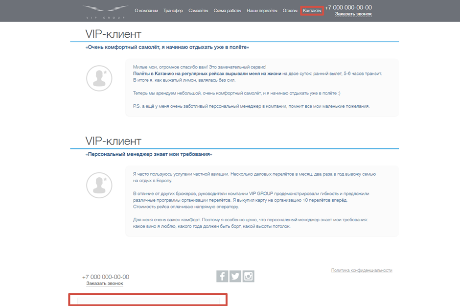
---

### ID: BUG-010  
**Название:** Сохранение введенных данных в полях форм после отправки

**Описание:**  
Введенные данные сохраняются во всех формах после отправки

**Шаги воспроизведения:**
1. Заполнить любую форму (заявки, заказа звонка/рейса).
2. Отправить форму.
3. Повторно откройте форму.
4. Наблюдаем: заполненные данные в полях сохраняются

**Ожидаемый результат:**  
Формы сбрасываются после отправки

**Фактический результат:**  
Введенные данные сохраняются в полях после отправки формы

**Серьезность:** `Major`

**Приоритет:** `High`

**Окружение:** Windows 10 Pro, версия 22H2, Яндекс Браузер версия 25.6.0.2261 (64-bit)

**Вложение:**
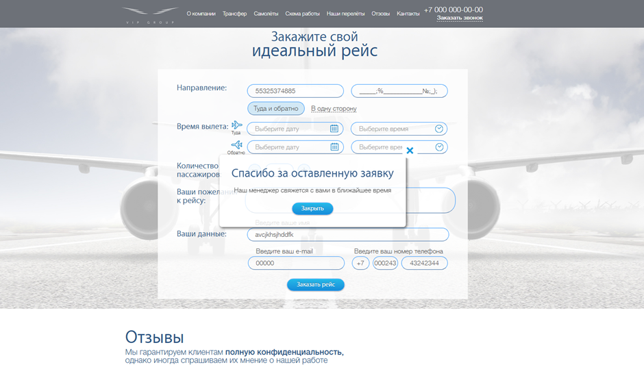
---

### ID: BUG-011  
**Название:** В пользовательском интерфейсе отображается технический вызов `request2()`

**Описание:**  
В блоке с текстом "Закажите срочный рейс в любую точку мира" отображается необработанная вставка `request2()`

**Шаги воспроизведения:**
1. Открыть страницу сайта.
2. Прочитать текст в центральном баннере.

**Ожидаемый результат:**  
Отображается только корректный информационный текст без плейсхолдеров

**Фактический результат:**  
В тексте присутствует необработанная строка `"request2()"` вместо части фразы

**Серьезность:** `Major`

**Приоритет:** `High`

**Окружение:** Windows 10 Pro, версия 22H2, Яндекс Браузер версия 25.6.0.2261 (64-bit)

**Вложение:**
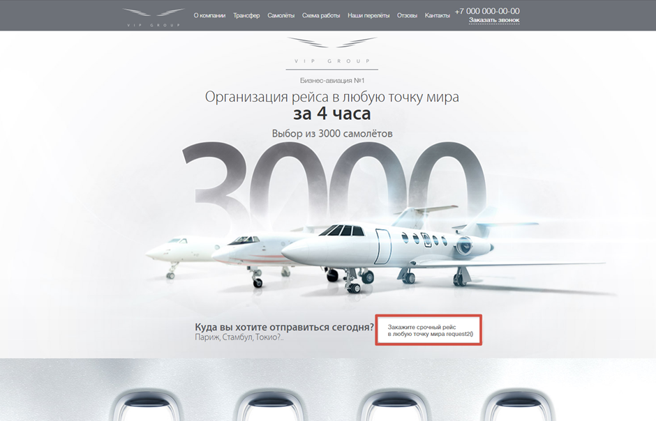
---

### ID: BUG-012  
**Название:** Орфографическая ошибка и лишний символ в заголовке страницы

**Описание:**  
В заголовке страницы отображается орфографическая ошибка ("мыра" вместо "мира") и лишний символ "&" в конце

**Шаги воспроизведения:**
1. Открыть сайт lucky-test.ru.
2. Обратить внимание на заголовок страницы во вкладке браузера.
3. Либо открыть HTML-код страницы и найти тег `<title>`.

**Ожидаемый результат:**  
Заголовок страницы корректный: "Организация рейса в любую точку мира"

**Фактический результат:**  
Заголовок: "Организация рейса в любую точку мыра &"

**Серьезность:** `Major`

**Приоритет:** `Medium`

**Окружение:** Windows 10 Pro, версия 22H2, Яндекс Браузер версия 25.6.0.2261 (64-bit)

**Вложение:**
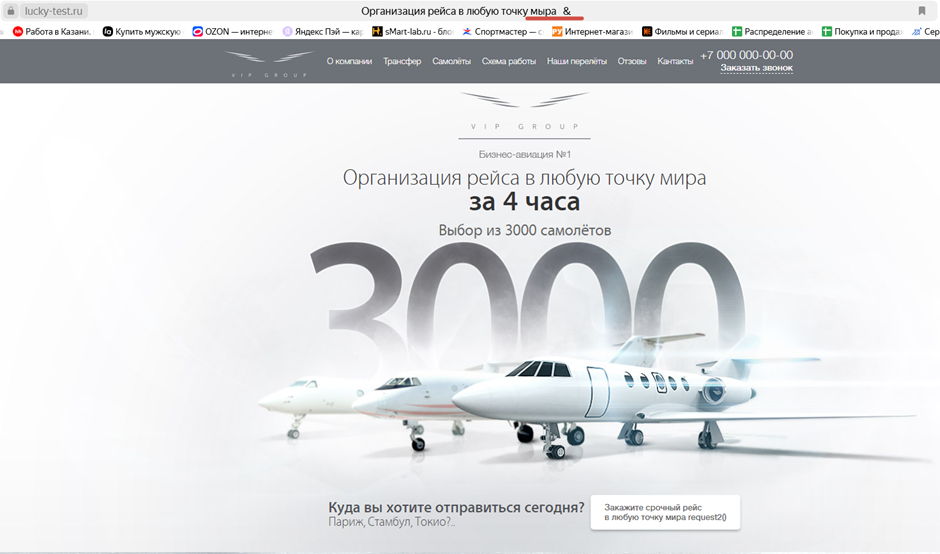
---

### ID: BUG-013  
**Название:** Несоответствие фотографии и текста в блоке менеджера Марии

**Описание:**  
В разделе "Истории наших перелётов" в блоке сотрудника с именем Мария и должностью «менеджер по работе с клиентами» размещена фотография мужчины. Это создаёт визуальное и контекстное несоответствие

**Шаги воспроизведения:**
1. Открыть сайт lucky-test.ru.
2. Перейти в раздел "Истории наших перелетов".
3. Обратить внимание на блок с заголовком "Мария".

**Ожидаемый результат:**  
В блоке с текстом о Марии размещена соответствующая фотография женщины

**Фактический результат:**  
В блоке отображается фотография мужчины (возможно, по ошибке скопирована с нижнего блока)

**Серьезность:** `Minor`

**Приоритет:** `Medium`

**Окружение:** Windows 10 Pro, версия 22H2, Яндекс Браузер версия 25.6.0.2261 (64-bit)

**Вложение:**
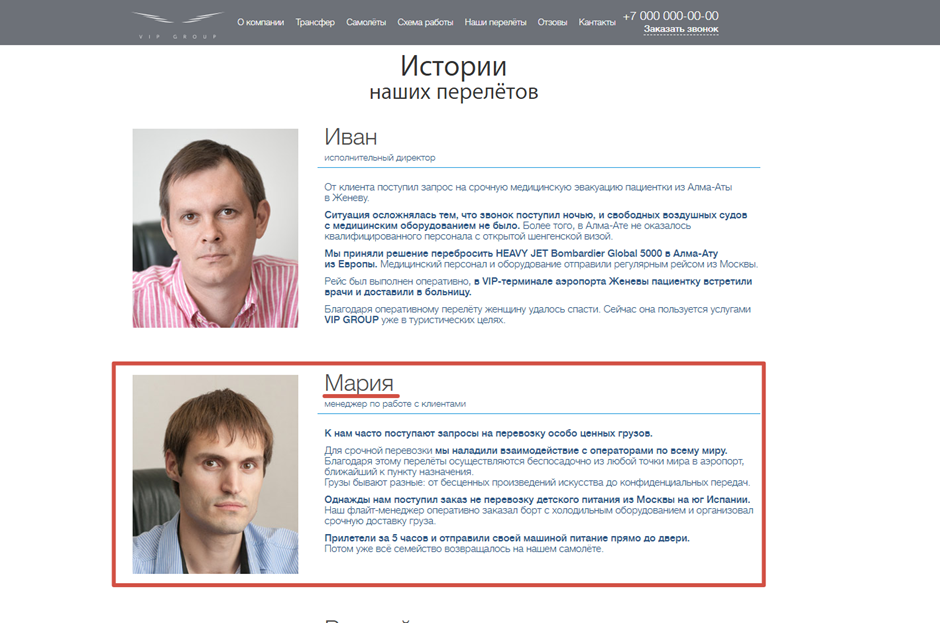
---

### ID: BUG-014  
**Название:** Орфографические ошибки в контенте

**Описание:**  
Ключевые слова содержат грубые орфографические ошибки

**Шаги воспроизведения:**
1. Открыть главную страницу сайта.
2. Проверить верхнее меню навигации.
3. Проверить блок "Никогда еще полет не был таким совершенным".
4. Проверить блок "Шампанское в подарок".

**Ожидаемый результат:**  
Корректное написание слов

**Фактический результат:**  
"Отзовы" (вместо "отзывы"), "кантакты" (вместо "контакты"), "шампанкое" (вместо "шампанское"), "возмём" (вместо "возьмём")

**Серьезность:** `Minor`

**Приоритет:** `Medium`

**Окружение:** Windows 10 Pro, версия 22H2, Яндекс Браузер версия 25.6.0.2261 (64-bit)

**Вложение:**
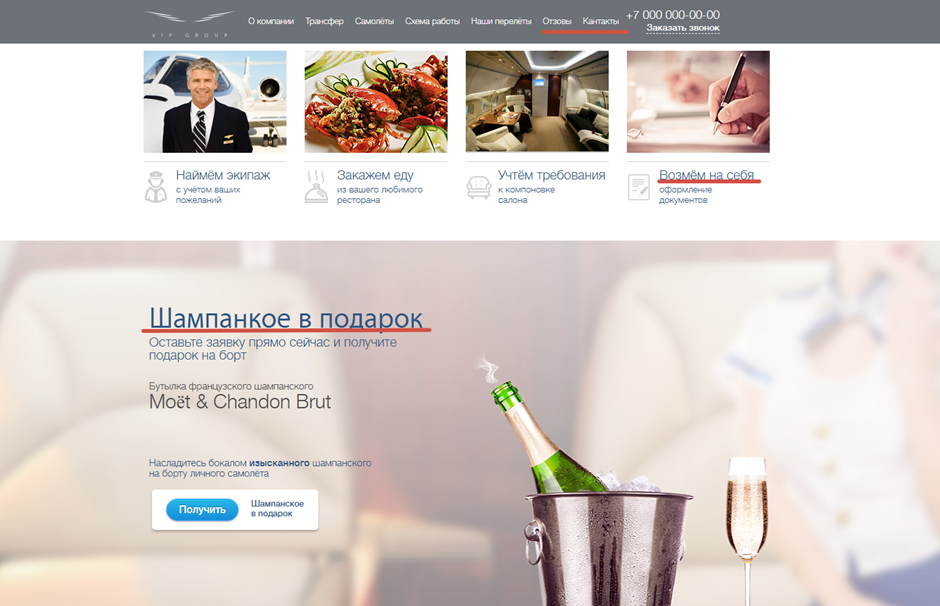
---

### ID: BUG-015  
**Название:** Нарушено выравнивание многострочных заголовков на странице

**Описание:**  
В заголовках на сайте "Работаем по всем направлениям", "Никогда еще полет не был таким совершенным", "Стандартная схема работы" нарушено центрирование текста между строками. Визуально нижние строки смещены влево, создавая впечатление сдвига и нарушая симметрию

**Шаги воспроизведения:**
1. Открыть сайт lucky-test.ru.
2. Найти блок с заголовком "Никогда еще полет не был таким совершенным".
3. Прокрутить до блока "Работаем по всем направлениям".
4. Найти блок с заголовком "Стандартная схема работы".
5. Визуально оценить выравнивание строк заголовков.

**Ожидаемый результат:**  
Все строки многострочных заголовков выровнены по центру визуально и стилистически

**Фактический результат:**  
Нижние строки заголовков визуально смещены влево, нарушая центрирование

**Серьезность:** `Minor`

**Приоритет:** `Medium`

**Окружение:** Windows 10 Pro, версия 22H2, Яндекс Браузер версия 25.6.0.2261 (64-bit)

**Вложение:**
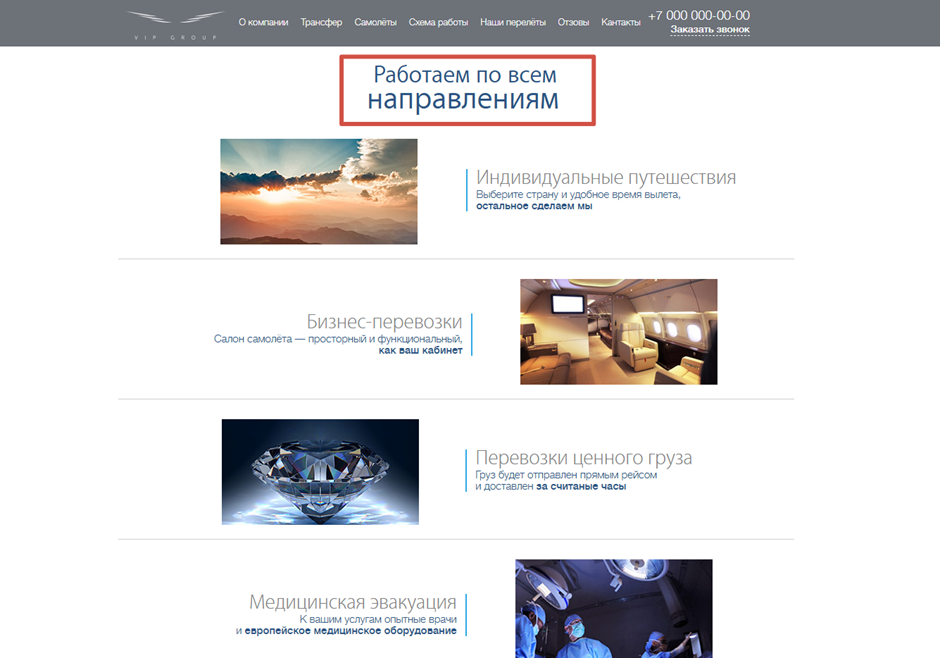
---

### ID: BUG-016  
**Название:** Нарушения в выравнивании элементов в блоке "Работаем по всем направлениям"

**Описание:**  
В разделе "Работаем по всем направлениям" синие вертикальные линии сбоку от карточек предназначены для визуального оформления. В блоке "Бизнес-перевозки" эта линия смещена вправо относительно других карточек, нарушая визуальную симметрию всей секции.

**Шаги воспроизведения:**
1. Открыть сайт lucky-test.ru.
2. Пролистать до раздела "Работаем по всем направлениям".
3. Обратить внимание на расположение вертикальных синих линий сбоку от текста в каждом блоке.
4. Сравнить блок "Бизнес-перевозки" с остальными (например, "Индивидуальные путешествия").

**Ожидаемый результат:**  
Все вертикальные линии выровнены по одной оси относительно текста и блока

**Фактический результат:**  
В блоке "Бизнес-перевозки" синяя линия визуально смещена вправо — нарушена общая сетка

**Серьезность:** `Minor`

**Приоритет:** `Medium`

**Окружение:** Windows 10 Pro, версия 22H2, Яндекс Браузер версия 25.6.0.2261 (64-bit)

**Вложение:**
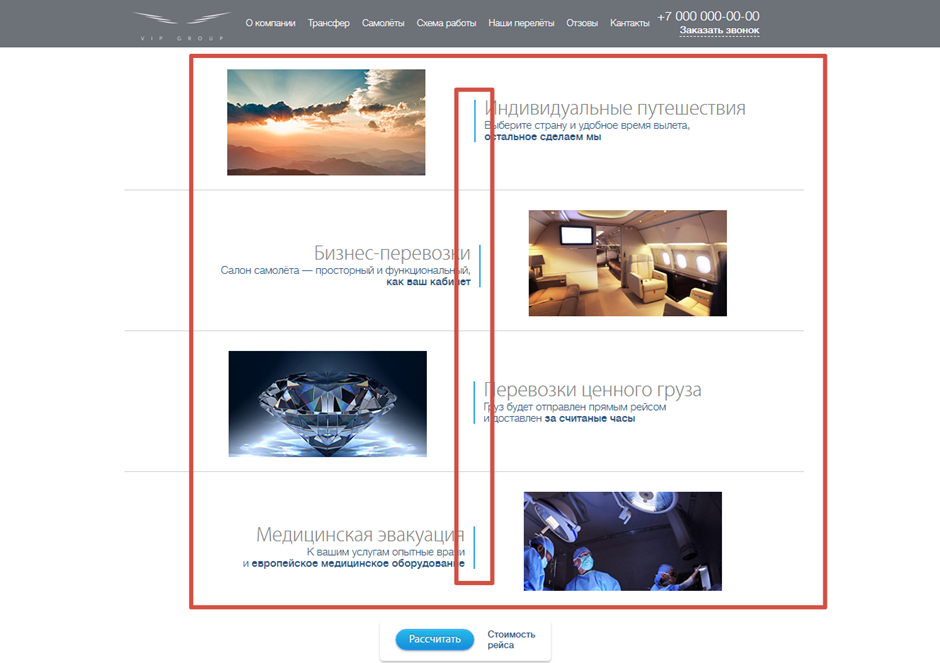
---

### ID: BUG-017  
**Название:** На мобильном разрешении (430 x 932) пропадает блок заказа вертолетного трансфера в разделе VIP трансфер

**Описание:**  
При адаптации сайта под разрешение 430×932 (iPhone 14 Pro Max) в разделе VIP трансфер полностью исчезает блок, посвященный трансферу на вертолёте Robinson. Пропадает как визуальный элемент (изображение), так и кликабельное поле для выбора или заказа трансфера. Кроме того, визуально нарушается единообразие шрифтов - заголовки и текст внутри раздела становятся неравномерными по размеру, в отличие от десктопной версии.

**Шаги воспроизведения:**
1. Открыть сайт lucky-test.ru в браузере.
2. Открыть DevTools (F12), перейти во вкладку "Device Toolbar".
3. Установить разрешение 430×932 или выбрать iPhone 14 Pro Max.
4. Пролистать до раздела "VIP трансфер".
5. Сравнить количество блоков с десктопной версией и обратить внимание на шрифты.

**Ожидаемый результат:**  
Все блоки, включая вертолет Robinson, отображаются корректно во всех разрешениях. Шрифт остаётся единообразным и читаемым, без произвольных скачков размера.

**Фактический результат:**  
Блок с вертолётом Robinson исчезает полностью. Нарушается визуальная иерархия шрифтов — текст выглядит фрагментированным и неравномерным.

**Серьезность:** `Major`

**Приоритет:** `High`

**Окружение:** Windows 10 Pro, версия 22H2, Яндекс Браузер версия 25.6.0.2261 (64-bit)

**Вложение:**
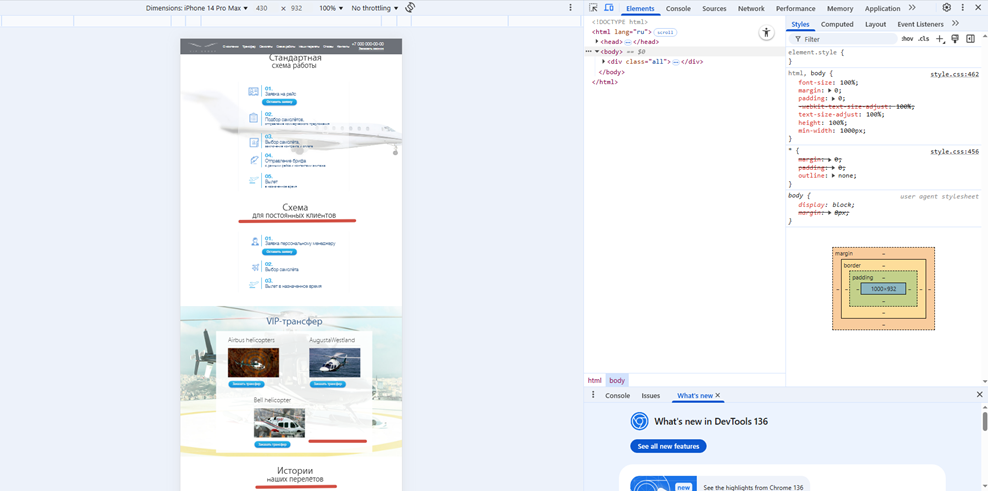