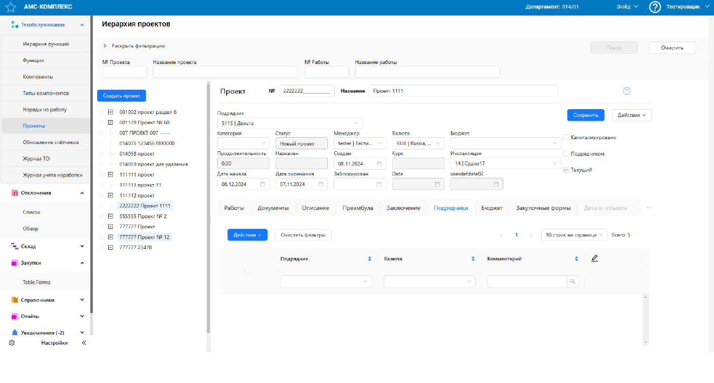

# Анализ интерфейса и чек-лист тестирования — окно "Создание проекта"

## Контекст задания

По предоставленному изображению формы «Создание проекта» необходимо:

- провести анализ видимых логических, функциональных и UX-ошибок;
- составить чек-лист для ручного тестирования данной формы.

---

## Выявленные ошибки и недочеты

### 1. Дата окончания раньше даты начала  
**Описание:**  
Дата окончания не может быть раньше даты начала. Это нарушает логическую последовательность событий.  
**Рекомендация:**  
Добавить клиентскую валидацию, которая блокирует выбор более ранней даты окончания, чем дата начала.

---

### 2. Поле "Date" на английском, при остальном интерфейсе на русском  
**Описание:**  
Поле имеет подпись "Date", что нарушает единообразие интерфейса.  
**Рекомендация:**  
Перевести заголовок поля на русский язык ("Дата").

---

### 3. Тестовые данные в полях (tester, userdefdate02)  
**Описание:**  
В полях отображаются значения, которые явно являются тестовыми или временными (например, "tester", "userdefdate02").  
**Рекомендация:**  
Удалить тестовые данные перед выпуском, использовать placeholder или стандартные значения.

---

### 4. Мусорные и дублирующие записи в списке проектов  
**Описание:**  
Примеры: "111111 проект", "111111 проект 11", "1111111 проект", "014059 проект для удаления".  
**Рекомендация:**  
Очистить дерево проектов от мусорных записей, проверить систему добавления новых проектов на наличие дублей.

---

### 5. Поле валюты содержит страну и многоточие  
**Описание:**  
Значение: "USD... (United States)". Такой формат вводит пользователя в заблуждение.  
**Рекомендация:**  
Использовать либо только код валюты, либо объединить с названием страны, но без многоточия и лишних символов.

---

### 6. Нет визуальной индикации обязательных полей  
**Описание:**  
Не обозначены обязательные поля (например, звёздочкой *).  
**Рекомендация:**  
Добавить маркеры обязательных полей для лучшего UX.

---

### 7. Поле "№ проекта" принимает недопустимые символы и не ограничено по длине  
**Описание:**  
Поле допускает ввод любых символов, хотя обычно номер проекта имеет строгий числовой или форматированный формат.  
**Рекомендация:**  
Добавить валидацию: ограничение длины, запрет спецсимволов, указание формата (например, PRJ-XXXX).

---

### 8. Некорректная визуализация вкладки "Детали объекта"  
**Описание:**  
Вкладка "Детали объекта" не отображается корректно — возможно, элементы перекрываются, обрезаются или не отображаются вовсе.  
**Рекомендация:**  
Проверить верстку и адаптивность контента внутри таба.

---

## ✅ Чек-лист тестирования интерфейса формы "Создание проекта"

### 🔹 Проверка валидации и логики

- [ ] Проверка валидации поля "№ проекта" на недопустимые символы
- [ ] Проверка ограничения длины "№ проекта"
- [ ] Проверка наличия обязательных полей (№, название, даты)
- [ ] Проверка валидации дат (окончание позже начала)
- [ ] Проверка невозможности отправки формы с пустыми обязательными полями
- [ ] Проверка наличия всплывающей подсказки при ошибке заполнения
- [ ] Проверка активации кнопки "Сохранить" при валидном вводе

### 🔹 Отображение и локализация

- [ ] Проверка локализации всех текстов и заголовков
- [ ] Проверка пояснений у полей (без тестовых данных userdefdate02)
- [ ] Проверка корректности отображения подтверждений

### 🔹 Работа со списком участников

- [ ] Проверка отображения выбранных участников
- [ ] Проверка возможности удалить участника до сохранения
- [ ] Проверка отображения скролла при большом количестве участников
- [ ] Проверка фильтрации/поиска в списке участников

### 🔹 Навигация и вкладки

- [ ] Проверка сохранения введенных данных при переключении между вкладками
- [ ] Проверка визуальной активности вкладок при выборе
- [ ] Проверка отображения вкладки "Детали объекта"

### 🔹 Кнопки и действия

- [ ] Проверка активности кнопки "Сохранить" при заполнении всех обязательных полей
- [ ] Проверка успешного создания проекта
- [ ] Проверка поведения при попытке сохранить пустую форму
- [ ] Проверка корректного сообщения об ошибке

---

